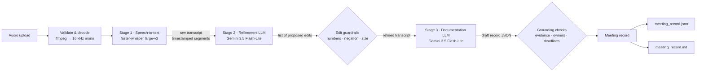

# Technical description

## Pipeline overview

The orchestrator (`meeting_assistant/pipeline.py`) runs the stages strictly in this order in one
workflow. It reports each stage's status to the UI. If a stage fails, the pipeline stops at that
stage, shows the error, and keeps any results already produced.

## Models and their roles

| Stage | Model | Role | Input → Output |
|---|---|---|---|
| 1 | **faster-whisper `large-v3`** (CTranslate2 port of OpenAI Whisper; `small.en` on CPU) | Speech-to-text | 16 kHz audio → timestamped segments (**raw transcript**) |
| 2 | **Gemini 3.5 Flash-Lite** (`REFINE_MODEL`) | Domain-aware transcript correction | Raw segments and optional glossary → list of `{segment_id, original, corrected, reason}` edits |
| 3 | **Gemini 3.5 Flash-Lite** (`DOCS_MODEL`) | Meeting documentation | Refined transcript → title, summary, minutes, decisions, action items, open items (structured JSON) |

The two language-model roles are separate stages. Each has its own model, system prompt
(`prompts/refine_system.md` and `prompts/document_system.md`) and output schema
(`RefinementResponse` and `DocumentationResponse` in `schema.py`). Both use Gemini's
structured-output mode, so responses are validated against Pydantic schemas. Temperature is set to
0.1 for faithful, repeatable output.

## How data moves between stages

1. **Validation:** the upload is checked for a supported extension, non-zero size and the 500 MB
   limit. It is then decoded with ffmpeg. A decode failure, a recording under 1 second, or a silent
   recording each produce a specific message.
2. **Stage 1:** Whisper runs with voice-activity detection, which skips silence and prevents
   hallucinated text in pauses. `condition_on_previous_text=False` prevents repetition loops on long
   audio. The optional user glossary is passed as a decoding hint. The output is a list of
   `Segment(id, start, end, text)`.
3. **Stage 2:** segments are sent with their IDs, in chunks of about 3,000 words. The model does
   **not** rewrite the transcript. It returns a list of minimal edits. Each edit is checked
   deterministically before it is applied (`guardrails.check_correction`) and is **rejected** if it:
   - changes any number (digits and number words are normalised, so "four" → "4" is allowed but "sixteen" → "15" is not)
   - adds or removes negation
   - spans more than 12 words or adds more than 3 words
   - quotes text that does not exist in that segment

   Accepted edits are applied to a copy of the segments, so the raw transcript stays untouched. Every
   proposal is logged with its status in `refinement_changes.json` and shown in the UI.
4. **Stage 3:** the refined, timestamped transcript goes to the documentation model. The prompt
   defines strict criteria:
   - Only explicitly agreed conclusions count as decisions. Proposals and deferred items go to `open_items`.
   - Owners and deadlines are recorded only when stated, verbatim.
   - Every decision, task and open item must include a short **verbatim evidence quote**.
5. **Grounding checks** (`document.verify_record`):
   - Each evidence quote is fuzzy-matched (RapidFuzz, threshold 80) against the transcript. A match
     attaches a timestamp; a quote that cannot be matched is flagged in the UI and the record.
   - An owner or deadline whose words do not appear in the transcript is replaced with
     **Unspecified**, and a note is added. Placeholders such as "TBD" are also normalised to Unspecified.
   - Participant names that are never spoken are removed.
6. **Export:** one `MeetingRecord` object is serialised to JSON, and the Markdown version is rendered
   from that same object. This guarantees both formats contain identical decisions and tasks. The
   raw and refined transcripts are exported as timestamped text.

## Design choices

- **Edit-list refinement rather than full rewrite:** a rewrite could silently alter names, numbers or
  commitments. Small edits can be verified and audited, and judges can compare raw and refined text
  line by line.
- **One model, two separate stages:** both language-model stages use Gemini 3.5 Flash-Lite, a fast,
  low-cost model that comfortably fits a full meeting transcript. They remain distinct stages: separate
  API calls, separate system prompts, separate output schemas, and stage 3 only ever sees the output of
  stage 2. Each stage's model can be changed independently (`REFINE_MODEL`, `DOCS_MODEL`).
- **Evidence-backed outputs:** requiring a quote for each item makes hallucinated decisions or tasks
  detectable automatically.

## Limitations

- No speaker diarization. When a task is accepted with "I'll do it" and the speaker cannot be
  identified from the words themselves, the owner is left Unspecified. This is deliberate: the
  system does not guess.
- English only. Whisper is run with `language="en"`.
- Free-tier Gemini quotas can rate-limit back-to-back runs. The client retries with exponential backoff.
